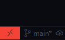
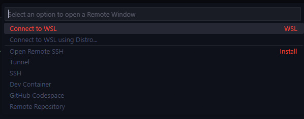

# Assembly Development Environment Setup Guide

[Bản tiếng Việt](readme-vi.md)

## Table of Contents
- [Quick Start](#quick-start)
- [Prerequisites](#prerequisites)
- [Setup Instructions](#setup-instructions)
  - [Windows Setup (using WSL)](#windows-setup)
  - [Native Linux Setup](#linux-setup)
- [Testing Your Environment](#testing-your-environment)
- [Common Issues](#common-issues)

## Quick Start
If you already have the environment set up:
1. Install required packages:
   - For Windows (WSL): Use the Debian/Ubuntu commands after connecting to WSL
   - For Linux: Use your distribution's package manager
2. Clone the repository: `git clone https://github.com/4w5om3/assembly-env.git`
3. Test the environment: `make run FILE=div1`

## Prerequisites

### For Windows Users
- Windows 10 or newer
- Administrator access
- At least 4GB of free disk space (recommended)

### For Linux Users
- Any Linux distribution
- Basic command line knowledge

## Setup Instructions

### Windows Setup (using WSL)

1. **Install WSL**
   - Open PowerShell as Administrator
   - Run: `wsl --install --no-distribution`
   - Restart your computer when prompted
   - After restart, run: `wsl --install -d Debian`
   - Set up your Linux username and password when prompted
   
   Note: You can list other available distributions with `wsl -l --online`

2. **Install VSCode**
   - Download VSCode from [here](https://code.visualstudio.com/download)
   - Install the WSL extension in VSCode
   - Connect to WSL:
     - Click the Remote icon in the bottom-left corner
     - Select "Connect to WSL"
     
     
     

3. **Install Required Packages (in WSL)**
   - Open VSCode
   - Connect to WSL (if not already connected)
   - Open terminal in VSCode (Ctrl + ` or View -> Terminal)
   - Install packages:
     ```bash
     sudo apt update && sudo apt upgrade
     sudo apt install nasm binutils make git gcc
     ```

4. **Setup Development Environment**
   - Clone the repository and navigate to the project directory:
     ```bash
     git clone https://github.com/4w5om3/assembly-env.git
     cd assembly-env
     code .
     ```

### Native Linux Setup

1. **Install VSCode**
   - For Debian/Ubuntu-based distributions:
     ```bash
     sudo apt-get install wget gpg
     wget -qO- https://packages.microsoft.com/keys/microsoft.asc | gpg --dearmor > packages.microsoft.gpg
     sudo install -D -o root -g root -m 644 packages.microsoft.gpg /usr/share/keyrings/packages.microsoft.gpg
     sudo sh -c 'echo "deb [arch=amd64,arm64,armhf signed-by=/usr/share/keyrings/packages.microsoft.gpg] https://packages.microsoft.com/repos/code stable main" > /etc/apt/sources.list.d/vscode.list'
     rm -f packages.microsoft.gpg
     sudo apt install apt-transport-https
     sudo apt update
     sudo apt install code
     ```
   
   - For Arch Linux:
     ```bash
     sudo pacman -S code
     ```
   
   - For Fedora:
     ```bash
     sudo rpm --import https://packages.microsoft.com/keys/microsoft.asc
     sudo sh -c 'echo -e "[code]\nname=Visual Studio Code\nbaseurl=https://packages.microsoft.com/yumrepos/vscode\nenabled=1\ngpgcheck=1\ngpgkey=https://packages.microsoft.com/keys/microsoft.asc" > /etc/yum.repos.d/vscode.repo'
     sudo dnf update
     sudo dnf install code
     ```

   Alternatively, you can download and install VSCode directly from the [official website](https://code.visualstudio.com/download).

2. **Install Required Packages**
   Choose your distribution and run the appropriate commands:

   #### Ubuntu/Debian/Linux Mint
   ```bash
   sudo apt update && sudo apt upgrade
   sudo apt install nasm binutils make git gcc
   ```

   #### Arch Linux
   ```bash
   sudo pacman -Syy && sudo pacman -Syyu
   sudo pacman -S nasm binutils make git gcc
   ```

   #### Fedora
   ```bash
   sudo dnf update && sudo dnf upgrade
   sudo dnf install nasm binutils make git gcc
   ```

3. **Setup Development Environment**
   - Open VSCode
   - Open terminal in VSCode (Ctrl + ` or View -> Terminal)
   - Clone the repository and navigate to the project directory:
     ```bash
     git clone https://github.com/4w5om3/assembly-env.git
     cd assembly-env
     code .
     ```

## Basic Linux Commands

Here are some essential commands you'll need:

### File and Directory Operations
```bash
# Create a new file
touch filename.s

# Create a new directory
mkdir directory_name

# Navigate to a directory
cd directory_name    # Go into directory
cd ..               # Go back one level
cd                  # Go to home directory

# List directory contents
ls                  # List files and directories
ls -la             # List with details and hidden files

# Remove files/directories
rm filename         # Remove a file
rm -r directory    # Remove a directory and its contents

# Copy and Move
cp file1 file2     # Copy file1 to file2
mv file1 file2     # Move/rename file1 to file2

# View file contents
cat filename       # Display file contents
nano filename      # Edit file with nano editor
code filename     # Open file in VSCode
```

## Testing Your Environment

1. View available make commands:
   ```bash
   make help
   ```
   This will show you all available commands and their usage.

2. Run the test program:
   ```bash
   make run FILE=div1
   ```
   Expected output:
   ```
   The quotient is 3
   The remainder is 1
   ```

3. Clean up:
   ```bash
   make clean
   ```

## Common Issues

- If terminal is not visible in VSCode, press `Ctrl + `` or go to View -> Terminal
- Make sure to type your Linux password carefully during WSL setup (characters won't be visible)
- If you encounter permission issues, ensure you're running PowerShell as Administrator
- For Windows users, make sure you're in the WSL terminal (it should show your Linux username) when running commands
